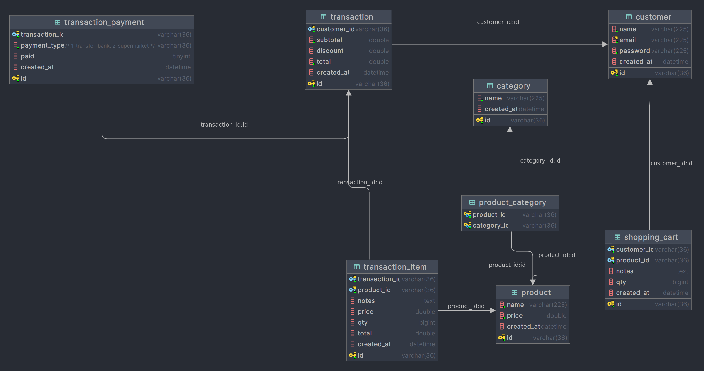

# golang-clean-code-rest

## About
This repository is implement clean code architecture and Restful API concept. 
Use [Fiber Go](https://gofiber.io/) as HTTP library and [GORM](https://gorm.io/index.html) for ORM library.
For database, this app is use MySQL and redis for cache and session.

For database schema you can see in below:


## Prerequisite
1. golang version 1.22.1
2. MySql
3. redis server

## How To Start
### Manual
1. Setup MySQL and redis server in your local computer
2. Clone this repository
    ```bash
   git clone https://github.com/ajaydeta/synapsis-challenge.git
   ```
3. Installing main project dependency
    ```bash
       go mod tidy
   ```
4. Running the server
   ```bash
       go run main.go
   ```
   
### Docker compose 
1. Setup MySQL and redis server in your local computer
2. Clone this repository
    ```bash
   git clone https://github.com/ajaydeta/synapsis-challenge.git
   ```
3. Compose Up
   ```bash
   docker compose up --build
   ```

> This app is running on port `:3000`

## Testing
After this app is running, this app will automatically migrate DB schema and seed dummy data for testing purpose.
Then you can see the API documentation in [here](https://www.postman.com/ajaydeta/workspace/synapsis-challenge).

## Author
Ajay Deta:
- [Github](https://github.com/ajaydeta/synapsis-challenge)
- [LinkedIn](https://www.linkedin.com/in/ajay-deta/)
